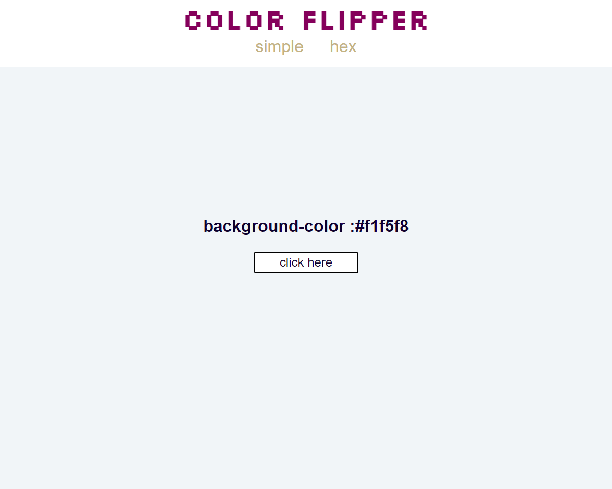

# COLOR FLIPPER 

O Color Flipper troca o background aleatoriamente ao clicar no botão "click here".
A categoria Simple tem uma mistura de valores hexadecimais, rgba e cores básicas.
A categoria Hex é gerada através dos números disponíveis no sistema hexadecimal, uma string aleatória de cor, ou seja, cada vez que o botão for clicado, uma cor completamente aleatória será gerada.

The color flipper is a random background color changer.
On the Simple category, has a mixture of hexadecimal, rgba, and basic color values.
On the Hex category, a random color string is generated through the numbers available in the hexadecimal system, making every click on the button, generate a new random color.

Key concepts covered (Principais conceitos abordados):

- Arrays
- DOM Manipulation (Manipulação de DOM)
- Event Handlers
- Math Global Object (Objeto global Math)
